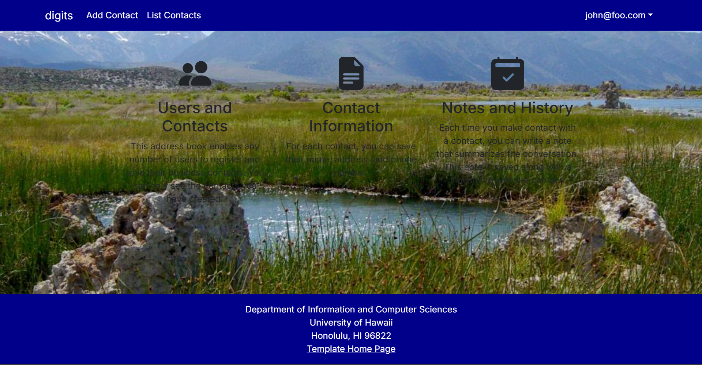

# digits

Digits is an application that allows users to:

- Register an account.
- Create and manage a set of contacts.
- Add notes about their interactions with each contact.

---

## Installation

### 1. Install Node.js and PostgreSQL

Make sure you have both Node.js (v18 or later) and PostgreSQL installed.  
You can download Node.js from [https://nodejs.org](https://nodejs.org)  
and PostgreSQL from [https://www.postgresql.org/download/](https://www.postgresql.org/download/).

---

### 2. Clone this repository

git clone https://github.com/rmasuda4/digits.git
cd digits
